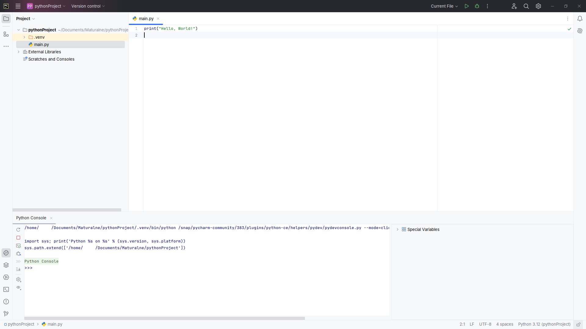

Jeśli korzystamy z systemu operacyjnego Windows, to Python nie jest domyślnie
zainstalowany i będziemy musieli go zainstalować. W większości dystrybucji
Linuxa Python jest zainstalowany domyślnie, ale zintegrowane środowisko
programistyczne i tak nam się przyda.

## Zintegrowane środowisko programistyczne (IDE)

IDE to (zwykle graficzny) program przeznaczony do programowania. Zawiera nie
tylko sam edytor kodu programu, ale także zestaw przydatnych narzędzi,
spośród których wyróżnić można wiersz poleceń (terminal) i debugger.

Czasami IDE współpracują z wieloma różnymi językami (np. Visual Studio Code),
a czasami są przeznaczone do pracy z konkretnym językiem (np. PyCharm został
dostosowany do potrzeb Pythona).

Najpopularniejsze IDE to:

- [Visual Studio](https://visualstudio.microsoft.com/)
- [Visual Studio Code](https://code.visualstudio.com/)
- [Eclipse](https://www.eclipse.org/downloads/) - raczej wychodzi już z użycia
- wiele różnych IDE firmy [JetBrains](https://www.jetbrains.com/ides/) (Intellij IDEA, PyCharm i inne)

## PyCharm

Przy zdawaniu matury z wybranym językiem programowania Python zalecam korzystanie
z PyCharma, który oferuje szeroki zestaw przydatnych funkcji i jest wygodny
w użyciu.

Na Windowsie możemy zainstalować PyCharma z jego [strony internetowej](https://www.jetbrains.com/pycharm/). Na Linuxie najłatwiej będzie skorzystać z pakietu
dostępnego w menadżerze pakietów [snap](https://snapcraft.io/pycharm-community).
W obu systemach możemy też skorzystać z narzędzia [JetBrains Toolbox](https://www.jetbrains.com/toolbox-app/),
które jest zupełnie niezależne od jakichkolwiek menadżerów pakietów.

Do tego musimy też zainstalować interpreter Pythona - na Windowsie najwygodniej
dostać go ze Sklepu Microsoft (np. "Python 3.12") a na Linuxie skorzystamy
z odpowiedniego menadżera pakietów.

Po zainstalowaniu PyCharma i utworzeniu nowego projektu z domyślnymi ustawieniami,
powinniśmy zobaczyć interfejs podobny do tego poniżej:



Niewykluczone, że w pustym projekcie nie będzie pliku `main.py`. Musimy go
wtedy utworzyć sami klikając prawym przyciskiem myszy na katalogu głównym
projektu (w tym wypadku `pythonProject`) i wybierając nowy plik Python.
Konsola (interpreter Pythona) w dolnej części ekranu również może nie być
domyślnie otwarta, więc możemy ją otworzyć klikając logo Pythona widoczne na
pasku z lewej strony (na zrzucie ekranu podświetlone na szaro).

Widzimy teraz:

- strukturę plików w projekcie po lewej stronie (folderem `.venv` nie musimy się w ogóle przejmować,
  a zainteresowani mogą o nim poczytać więcej [tutaj](https://docs.python.org/3/library/venv.html))
- główne okno edycji na środku
- przyciski do uruchamiania programu w prawym górnym rogu - na razie interesuje nas
  tylko przycisk "play", ale później wytłumaczone zostanie też zastosowanie
  przycisku z ikonką robaka
- interpreter Pythona na dole (więcej o nim za chwilę)

Jeśli do pliku `main.py` przepiszemy kod ze zrzutu ekranu i naciśniemy przycisk
"play" w prawym górnym rogu, to program wykona się i w okienku na dole powinien
wypisać się tekst:

```
Hello, World!
```

## Interpreter Pythona

Język Python posiada interpreter, czyli konsolę, w której możemy wpisywać
instrukcje (wyrażenia), które będą na bieżąco wykonywane przez Pythona. Jest
to przydatne przy nauce Pythona lub przy testowaniu różnych zachowań. Spróbuj
wpisać do interpretera kilka poleceń, żeby sprawdzić czy działa:

```
>>> 5 + 3
8
>>> print("Hello, World!")
Hello, World!
```

W Linuxie interpreter można uruchomić także otwierając terminal i wykonując
polecenie `python` lub `python3`.

Więcej o Pythonie dowiemy się w kolejnych rozdziałach.
