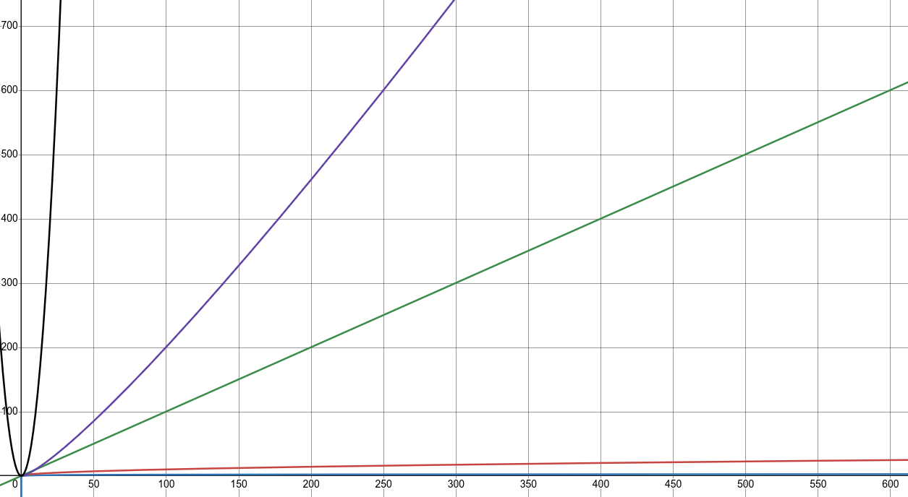

# Wstęp

W tym dziale omówiono i opracowano różne zagadnienia algorytmiczne, jak również
struktury danych, których znajomość jest wymagana lub przydatna na maturze.

Przy omawianiu algorytmów często będziemy mówili, że pewne algorytmy są lepsze
lub gorsze od innych, ale potrzebujemy do tego jakiejś mierzalnej wielkości,
która pozwoli je obiektywnie porównać. Tę wielkość nazywamy w informatyce
złożonością (obliczeniową lub pamięciową). Złożoność mówi nam ile _z grubsza_
czasu lub pamięci potrzebuje algorytm do wykonania swojego zadania
_względem rozmiaru danych wejściowych_. Dane wejściowe to nic innego jak
argumenty funkcji, czyli na przykład lista, liczba, napis.

A co to oznacza _z grubsza_? Mamy tu na myśli, że chodzi nam tylko o rząd
wielkości czyli np. `2n` to _z grubsza_ `n` i stała `2` nas nie interesuje.
Podobnie `3n` to tyle samo co `2n` i `n`. Jeśli jednak złożoność będzie
wynosiła `n^2`, to `n^2 > n`. Łatwiej będzie nam wszystko zrozumieć po
obejrzeniu poniższych przykładów.

## Złożoność obliczeniowa

Załóżmy, że nasz algorytm szuka największego elementu na liście. Naturalnym
powinno dla nas być, że wystarczy przejrzeć wszystkie elementy listy po kolei
i wskazać największy. Możemy to zrobić np. w ten sposób:

```python showLineNumbers
def find_max(l: list[int]) -> int:
  current_max: int = -1

  for e in l:
    if e > current_max:
      current_max = e
  
  return current_max
```

Żeby ustalić złożoność obliczeniową tego algorytmu, musimy najpierw ustalić, co
jest rozmiarem danych wejściowych. W tym wypadku będzie to długość listy, którą
oznaczamy jako `n`. Dla każdego elementu listy musimy wykonać stałą liczbę
operacji - jedno porównanie i ewentualnie jedno przypisanie. W takim razie
dla każdego _z grubsza_ `n` elementów wykonujemy _z grubsza_ jedną operację.

Złożoność zapisujemy w notacji dużego O, czyli w tym wypadku złożoność to
`O(n)` (czytamy "o od n").

## Złożoność pamięciowa

Złożoność pamięciowa oznacza ile dodatkowej pamięci (poza danymi wejściowymi)
potrzebuje nasz algorytm. Pamięć wejściowa nigdy nie liczy się do złożoności
pamięciowej. Przykładowo funkcja `sort()` na liście, dostępna w bibliotece
standardowej Pythona, nie wymaga żadnej dodatkowej pamięci, ponieważ sortuje
elementy listy i nie tworzy żadnych nowych list. O takim algorytmie mówimy, że
wymaga pamięci stałej lub działa w miejscu.

Przyjrzyjmy się dwóm poniższym algorytmom, które odwracają elementy pewnej
listy:

```python showLineNumbers
def list_rev_1(l: list[int]) -> list[int]:
  length: int = len(l)

  for i in range(length // 2):
    tmp: int = l[i]
    l[i] = l[length - i - 1]
    l[length - i - 1] = tmp
  
  return l

def list_rev_2(l: list[int]) -> list[int]:
  res: list[int] = []
  for e in l:
    res.append(e)
  
  return res
```

Algorytmy te wyglądają dosyć podobnie, ale pierwszy działa w pamięci stałej,
ponieważ odwraca elementy na liście, którą dostał. Zwróćmy uwagę, że pomimo że
funkcja `list_rev_1()` zwraca listę, to jest to ta sama lista, co lista wejściowa
i nie wymagała zajęcia żadnej dodatkowej pamięci.
ə
Drugi algorytm działa w pamięci liniowej, ponieważ jeśli długość listy wejściowej
oznaczymy jako `n`, to musimy stworzyć nową listę o długości `n`. Zużyliśmy więc
dodatkową pamięć równą `O(n)` na stworzenie nowej listy tej samej długości.

## Nazewnictwo

Więcej przykładów będzie się pojawiało w trakcie poznawania nowych zagadnień
algorytmicznych, ale warto zapamiętać kolejność złożoności:

`O(1) < O(log(n)) < O(sqrt(n)) < O(n) < O(n*log(n)) < O(n^2)`

Różnice widać bardzo wyraźnie na wykresie:




Od wykresu najbliższego osi OX są to:
- `O(1)` - czas/pamięć stała (brak na wykresie)
- `O(log(n))` - czas/pamięć logarytmiczna (niebieski)
- `O(sqrt(n))` - czas/pamięć pierwiastkowa (czerwony)
- `O(n)` - czas/pamięć liniowa (zielony)
- `O(n*log(n))` - czas/pamięć liniowo-logarytmiczna (fioletowy)
- `O(n^2)` - czas/pamięć kwadratowa (czarny)
